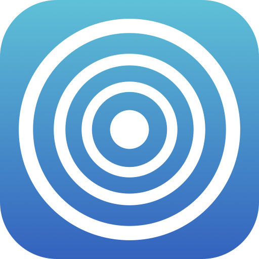
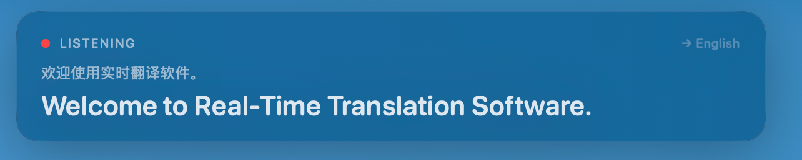
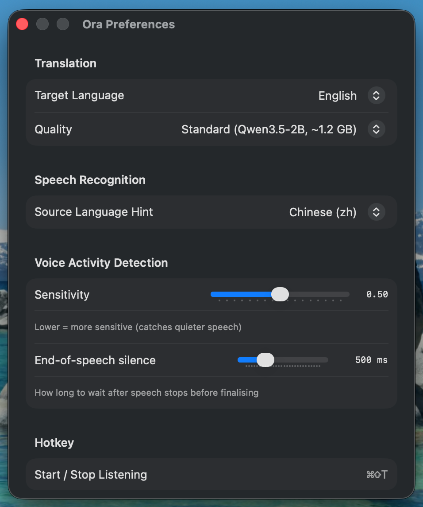
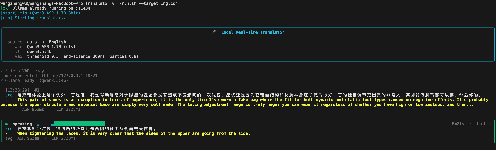

<p align="center">
  
</p>

<h1 align="center">Ora</h1>

<p align="center">
  <strong>Real-time local speech translation for macOS.</strong><br/>
  Everything runs on your Mac — no cloud, no API keys, no data ever leaves the device.
</p>

<p align="center">
  <a href="https://github.com/wuwangzhang1216/ora/releases/latest">
    
  </a>
  
  
  
</p>

---

## What is Ora?

Ora listens to your microphone and streams live translations of what you say into a floating caption window, using on-device MLX models for both speech recognition and translation. It's designed as a small, focused menu-bar app — click once, talk, read.

- 🎙 **Native real-time**: on-device voice activity detection, speech recognition, and translation, all on the Metal GPU
- 🔒 **100% local**: no network calls after the one-time model download, no API keys, no telemetry
- ⚡️ **Low latency**: sub-second caption updates while you're still speaking
- 🪟 **Minimal UI**: menu bar icon + a single floating caption card, keyboard-shortcut driven
- 🌍 **Multilingual**: translate between Chinese, English, Japanese, Korean, French, German, Spanish, and more
- 🎚 **Tunable**: preferences for target language, quality tier, VAD sensitivity, end-of-speech window

## Screenshots

<p align="center">
  
  <br/>
  <em>Floating caption card — source text above, large translation below, live status indicator + target-language chip.</em>
</p>

<p align="center">
  
  <br/>
  <em>Preferences — target language, quality tier, ASR source hint, VAD sensitivity + end-of-speech window, hotkey.</em>
</p>

## Download

Grab the signed and notarized `Ora.dmg` from the [latest release](https://github.com/wuwangzhang1216/ora/releases/latest), double-click to mount, drag **Ora.app** to **Applications**, launch.

- Requires **macOS 15 (Sequoia) or later** and an **Apple Silicon** Mac (M1/M2/M3/M4)
- ~1.2 GB of model weights download on first launch
- First launch prompts for microphone access — required for speech capture

### What's new in 0.5.0

- Native macOS caption layouts: Bilingual, Translation Only, and Compact
- Room-aware VAD presets: Quiet Room, Meeting, Noisy Room, and Custom
- Faster daily workflow controls: copy current / last translation and export transcript history
- CLI setup upgrades: preflight checks, microphone selection, demo mode, room presets, and Markdown / TXT / JSONL / SRT session export

## Usage

1. Click the echo-ring icon in the menu bar.
2. Choose **Start Listening** (or press ⌘⇧T from anywhere).
3. Speak. The floating caption window appears automatically.
4. Hover the caption window to reveal ⏸ / ⧉ / ✕ controls (pause, copy translation, hide).
5. Press ⌘, for Preferences — change target language, quality tier, caption layout, VAD room preset, and caption size.

### Keyboard shortcuts

| Shortcut | Action |
|----------|--------|
| ⌘⇧T | Start / stop listening (global) |
| ⌘⇧H | Show / hide caption window |
| ⌘, | Preferences |
| ⌘Q | Quit Ora |

### macOS UX controls

The native macOS app includes the same daily-use tuning as the reference CLI:

- **Caption layout**: Bilingual, Translation Only, or Compact for screen sharing
- **Room presets**: Quiet Room, Meeting, Noisy Room, or Custom VAD settings
- **Fast copy**: copy the current or last translation from the menu bar, or from the caption card hover controls
- **Transcript history**: export the current session or all history as TXT, SRT, JSON, or Markdown

### Quality tiers

| Tier | Download | Best for |
|------|----------|----------|
| **Standard** (default) | ~1.2 GB | Casual conversation, news, video |
| **High** | ~3 GB | Nuanced content, technical terms |
| **Extra High** | ~6 GB | Literary content, specialized terminology |

Switch at any time from the menu bar → **Quality**. Higher tiers are more accurate but slower and use more memory; the weights download automatically on first use.

## How it works

```
┌──────────┐    ┌───────────┐    ┌──────────────┐    ┌────────────────┐
│  Mic     │───▶│   VAD     │───▶│     ASR      │───▶│  Translator    │
│          │    │ endpoint  │    │ on-device    │    │   on-device    │
│          │    │ detection │    │  Metal GPU   │    │   Metal GPU    │
└──────────┘    └───────────┘    └──────────────┘    └────────────────┘
     │                                                        │
     └── AVAudioEngine ──────────────────────▶ SwiftUI Caption Card
```

Four stages run entirely on the Metal GPU via [MLX Swift](https://github.com/ml-explore/mlx-swift) — no Python, no Ollama, no external server. Partial results stream back to the caption card while you're still speaking; the final translation is committed once a short silence is detected.

> The native Swift source for the Ora macOS app lives in [`macos/Ora`](macos/Ora).
> The Python reference implementation below mirrors the same architecture with
> open dependencies for fast experimentation and terminal-first testing.

## Python CLI (open-source reference implementation)

<p align="center">
  
  <br/>
  <em>Live rich-terminal UI — status bar, per-utterance source + translation, scrolling history, and a real-time VAD probability meter.</em>
</p>

A Python implementation lives in [`main.py`](main.py) — the same architecture as the Ora macOS app, built on top of `mls` (an MLX model serving daemon) for ASR and Ollama for translation. It's useful for:

- Running on macOS versions that don't meet the Ora app's 15.0 requirement
- Reading / forking a fully open-source implementation of the same pipeline
- Iterating on prompts or VAD settings without rebuilding anything
- Watching a live VAD-level meter in a rich terminal UI

The CLI mirrors the Ora app's endpointing and partial-commit cadence, and exposes the same Standard / High / Extra High quality tiers via `--quality`.

```bash
# One-shot install (creates .venv, pulls translator models, clones the ASR server, preloads weights)
./setup.sh

# Start ASR + translator server + CLI
./run.sh --target English --asr-lang zh

# Bump translation quality
./run.sh --quality high
./run.sh --quality extra-high
```

### CLI UX tools

The reference CLI includes a few daily-use affordances that make it easier to set up, tune, and review a session:

```bash
# Run the terminal UI without mic / mls / Ollama, useful for a quick visual check
python main.py --demo --save-session

# Inspect microphones, then pick one by id or name
python main.py --list-devices
./run.sh --device "MacBook Pro Microphone"

# Tune endpointing for the room
./run.sh --preset quiet
./run.sh --preset meeting
./run.sh --preset noisy

# Save finalized bilingual captions
./run.sh --save-session --output-format markdown
./run.sh --save-session --output-format txt
./run.sh --save-session --output-format jsonl
./run.sh --save-session --output-format srt
```

On normal runs, Ora now performs a preflight readiness check before opening the mic: microphone availability, `mls`, Ollama, and the selected translator model. Use `--skip-preflight` only when you intentionally want the old direct-start behavior.

See [setup.sh](setup.sh) and [run.sh](run.sh) for the full dependency chain.

## Privacy

Ora doesn't phone home. The only network traffic is the initial HuggingFace model download, after which the app runs fully offline. No telemetry, no crash reporting, no analytics. Microphone audio never leaves your machine.

## License

MIT.
