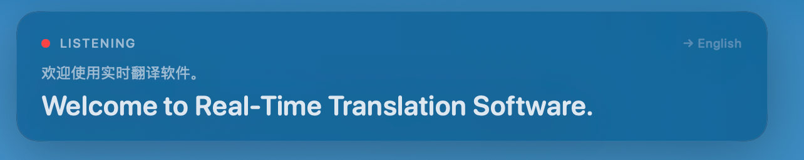
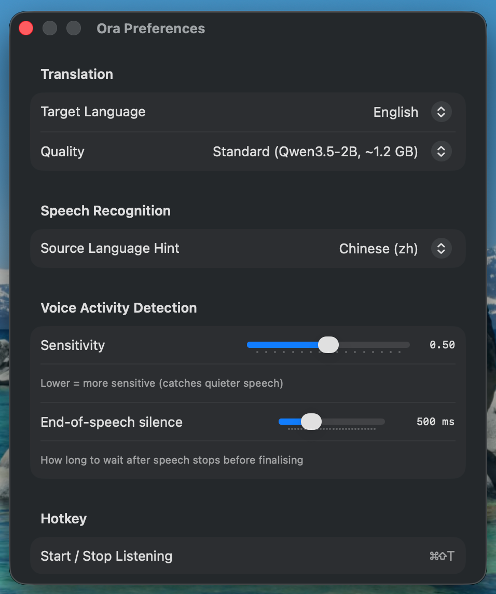
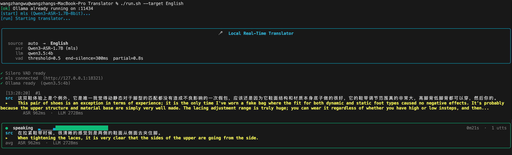

<p align="center">
  
</p>

<h1 align="center">Ora</h1>

<p align="center">
  <strong>Real-time local speech translation for macOS.</strong><br/>
  Everything runs on your Mac — no cloud, no API keys, no data ever leaves the device.
</p>

<p align="center">
  <a href="https://github.com/wuwangzhang1216/ora/releases/latest">
    
  </a>
  
  
  
</p>

---

## What is Ora?

Ora listens to your microphone and streams live translations of what you say into a floating caption window, using on-device MLX models for both speech recognition and translation. It's designed as a small, focused menu-bar app — click once, talk, read.

- 🎙 **Native real-time**: on-device voice activity detection, speech recognition, and translation, all on the Metal GPU
- 🔒 **100% local**: no network calls after the one-time model download, no API keys, no telemetry
- ⚡️ **Low latency**: sub-second caption updates while you're still speaking
- 🪟 **Minimal UI**: menu bar icon + a single floating caption card, configurable-shortcut driven
- 🌍 **Multilingual**: translate between Chinese, English, Japanese, Korean, French, German, Spanish, and more
- 🎚 **Tunable**: preferences for target language, quality tier, global hotkey, VAD sensitivity, end-of-speech window

## Screenshots

<p align="center">
  
  <br/>
  <em>Floating caption card — source text above, large translation below, live status indicator + target-language chip.</em>
</p>

<p align="center">
  
  <br/>
  <em>Preferences — target language, quality tier, ASR source hint, VAD sensitivity + end-of-speech window, hotkey.</em>
</p>

## Download

Grab `Ora.dmg` from the [latest release](https://github.com/wuwangzhang1216/ora/releases/latest), double-click to mount, and drag **Ora.app** to **Applications**.

Release packages are signed with a Developer ID. Check each release's notes for its notarization status. Older packages, including **v0.8.0**, were released without notarization and may trigger a macOS first-launch warning.

- Requires **macOS 15 (Sequoia) or later** and an **Apple Silicon** Mac (M1/M2/M3/M4)
- Model weights download on first launch; download size depends on the selected quality tier
- First launch prompts for microphone access — required for speech capture

### What's new in 0.9.0

- New **Meeting (System + Microphone)** input captures both sides of a Zoom call into the same captions and transcript history
- Align system and microphone audio by capture timestamps, with bounded mixing buffers and a short jitter allowance
- Convert each input's native audio format separately, including 44.1 kHz microphones and 48 kHz system audio
- Show microphone permission and capture startup/interruption errors without silently falling back to one-sided capture
- Keep transcript source metadata tied to the input selected when the session starts
- Preserve existing Microphone and System Audio preferences; select Meeting explicitly to enable both inputs

Use headphones to reduce acoustic echo. Meeting mode mixes the inputs without identifying speakers or cancelling echo; simultaneous speech may reduce recognition accuracy. Ora captures the microphone independently of Zoom's mute button and saves text transcripts rather than audio recordings.

### What's new in 0.8.0

- Stream recognized speech immediately and translate token by token, entirely on device
- Paginate captions at sentence, clause, and measured reading-length boundaries without clipping unread text
- Keep already-read captions in order when recognition or translation revises earlier wording
- Keep English visible while Chinese continues paging, and preserve the translation while longer source text finishes
- Reduce display waits when another segment is queued; the default Meeting preset now finalizes after about 300 ms of silence
- Share recent committed context between live and final translations, and prevent prompt labels such as “Source:” from appearing in subtitles
- Clear captions at session start/end, save recognized unfinished speech, and show the session duration after local history writes succeed
- Add deterministic caption regressions and real-model replay tests covering more than two minutes of continuous operation

### What's new in 0.6.2

- Fixed a freeze during long listening sessions where captions stopped updating and old translations repeated — the audio/VAD pipeline could fall ever further behind real time when ASR + translation were slower than incoming speech
- Audio and VAD-event buffers are now bounded, so the pipeline sheds the oldest backlog instead of accumulating it without limit (applies to both the macOS app and the Python reference CLI)

### What's new in 0.6.1

- Experimental Rapid-MLX backend for lower-latency local translation in the macOS app
- Preferences toggle for MLX Swift vs Rapid-MLX, with configurable local server URL and model name
- Rapid-MLX benchmark tooling and documented setup for the Python reference CLI

### What's new in 0.6.0

- New Transcript History window for browsing past sessions inside Ora
- Search, copy, refresh, and export transcript sessions without opening JSONL files manually
- Preferences reorganized into General, Captions, Advanced, and History tabs
- Faster access to transcript history from the menu bar and caption hover controls

### What's new in 0.5.1

- Configurable macOS Start / Stop Listening hotkey in Preferences
- New default global shortcut: ⌥Space, avoiding Chrome / Brave's reopen-closed-tab shortcut
- Legacy ⌘⇧T remains available as an opt-in shortcut

### What's new in 0.5.0

- Native macOS caption layouts: Bilingual, Translation Only, and Compact
- Room-aware VAD presets: Quiet Room, Meeting, Noisy Room, and Custom
- Faster daily workflow controls: copy current / last translation and export transcript history
- CLI setup upgrades: preflight checks, microphone selection, demo mode, room presets, and Markdown / TXT / JSONL / SRT session export

## Usage

1. Click the echo-ring icon in the menu bar.
2. Choose **Start Listening** (or press ⌥Space from anywhere).
3. Speak. The floating caption window appears automatically.
4. Hover the caption window to reveal ⏸ / ⧉ / ✕ controls (pause, copy translation, hide).
5. Press ⌘, for Preferences — change target language, quality tier, global hotkey, caption layout, VAD room preset, and caption size.

### Keyboard shortcuts

| Shortcut | Action |
|----------|--------|
| ⌥Space | Start / stop listening (global, configurable in Preferences) |
| ⌘⇧H | Show / hide caption window |
| ⌘, | Preferences |
| ⌘Q | Quit Ora |

### macOS UX controls

The native macOS app includes the same daily-use tuning as the reference CLI:

- **Caption layout**: Bilingual, Translation Only, or Compact for screen sharing
- **Configurable hotkey**: change Start / Stop Listening from the default ⌥Space, including a legacy ⌘⇧T option
- **Room presets**: Quiet Room, Meeting, Noisy Room, or Custom VAD settings
- **Fast copy**: copy the current or last translation from the menu bar, or from the caption card hover controls
- **Transcript history**: export the current session or all history as TXT, SRT, JSON, or Markdown

### Live captions for meetings

For both sides of a Zoom meeting, select **Preferences → General → Audio Input →
Meeting (System + Microphone)**, then start listening. Ora captures other participants
through system audio and your voice through the default macOS microphone, aligns the
two streams in time, and transcribes/translates them into the same caption window
and transcript history. Allow both microphone and Screen & System Audio Recording
access when macOS asks. Select the same microphone in macOS Sound settings and Zoom.
Ora captures the microphone independently of Zoom's mute button; stop listening in
Ora when you want it to stop capturing your voice.

Use headphones in Meeting mode: speaker output can enter the microphone and cause
duplicate or echoing speech. This mode mixes the inputs; it does not identify speakers,
cancel acoustic echo, or guarantee recognition of simultaneous speakers. System audio
includes other apps, so mute unrelated media/notifications during a meeting. Ora saves
text transcripts, not audio recordings. Input changes take effect at the next Start Listening.

**System Audio** still captures only the computer's playback, and **Microphone** only
your microphone. Existing input preferences are preserved.

During speech, Ora displays the recognized source immediately and streams translated
text as the local model generates it. A separate local caption scheduler breaks
paragraphs at sentence punctuation, suitable clause boundaries, and reading-length
limits. Each cue fits two lines measured with the actual caption font. Long text
continues on subsequent cues instead of being cut off with an ellipsis.

Cues use translation-first live pacing (normally 0.75–2.4 seconds per cue), shortening
their dwell under backlog pressure (at most 1.2 seconds once another segment is
queued). Long source text does not hold a short translation,
and repeated wording revisions cannot indefinitely restart a page's reading clock.
Unread text waits in order; later
recognition and translation cannot replace a cue before its reading time finishes.
The default Meeting endpoint waits about 300 ms of silence; explicit saved silence
settings are preserved. Pipeline timing logs separate inference-queue wait, partial
finalization wait, ASR time, and translation first-token time without logging speech.
Slow partial updates (750 ms or longer) also report recognition/first-token timing and
cancellation status, so live-path stalls can be distinguished from display waits.
If speech outpaces reading, the display shows the number of queued segments rather
than automatically skipping them. Starting or ending a session clears the caption
display and its unread pages. Ending saves completed transcripts and the latest
recognized unfinished utterance locally, then shows the session duration and a
**Session saved** receipt only after disk writes succeed. Empty sessions are labeled
as having no recognized speech; write failures remain available in memory for export
through History. Each Start creates a separate history session. Caption read positions
only move forward: revised wording is aligned with the current read boundary and
updates unread text, without replaying old pages. The full corrected original and
translation remain available in transcript history. Both live and final translations
use the same rolling context of up to four recent committed exchanges (oversized
exchanges are excluded), keeping pronouns and terminology consistent.
When one language finishes paging earlier, its last page stays visible alongside
the remaining pages of the same utterance. Held text is never consumed twice or
carried into a different utterance. Final transcript history still stores whole
utterances, independently of display pages.

For a local presentation-only preview without recording or loading models:

```bash
cd macos/Ora
./run.sh --caption-layout-preview
# Reproduce unequal English/Chinese page counts:
./run.sh --caption-bilingual-preview
```

The recognizer still processes rolling audio snapshots, rather than decoding every
spoken word in isolation. Update speed depends on your Mac and the selected model;
translation can revise wording as more context arrives. These changes run locally
with the existing models and require no cloud service.

### Quality tiers

| Tier | Download | Best for |
|------|----------|----------|
| **Standard** (default) | ~1.2 GB | Casual conversation, news, video |
| **High** | ~3 GB | Nuanced content, technical terms |
| **Extra High** | ~6 GB | Literary content, specialized terminology |

Switch at any time from the menu bar → **Quality**. Higher tiers are more accurate but slower and use more memory; the weights download automatically on first use.

### Experimental Rapid-MLX backend

Ora's macOS app defaults to in-process MLX Swift translation. For latency experiments, Preferences → **General** → **LLM Backend** can switch the app to a local Rapid-MLX server.

```bash
uv pip install --python .venv/bin/python rapid-mlx
.venv/bin/rapid-mlx serve qwen3.5-4b \
  --served-model-name default \
  --host 127.0.0.1 \
  --port 8000 \
  --no-thinking \
  --pin-system-prompt \
  --stream-interval 1
```

Then choose **Rapid-MLX** in Preferences, keep the URL as `http://127.0.0.1:8000/v1`, and click **Reconnect Translator**. This is opt-in; packaged releases still work offline with MLX Swift and do not manage the Rapid-MLX process.

## How it works

```
┌──────────┐    ┌───────────┐    ┌──────────────┐    ┌────────────────┐
│  Mic     │───▶│   VAD     │───▶│     ASR      │───▶│  Translator    │
│          │    │ endpoint  │    │ on-device    │    │   on-device    │
│          │    │ detection │    │  Metal GPU   │    │   Metal GPU    │
└──────────┘    └───────────┘    └──────────────┘    └────────────────┘
     │                                                        │
     └── AVAudioEngine ──────────────────────▶ SwiftUI Caption Card
```

Four stages run entirely on the Metal GPU via [MLX Swift](https://github.com/ml-explore/mlx-swift) — no Python, no Ollama, no external server. Partial results stream back to the caption card while you're still speaking; the final translation is committed once a short silence is detected.

> The native Swift source for the Ora macOS app lives in [`macos/Ora`](macos/Ora).
> The Python reference implementation below mirrors the same architecture with
> open dependencies for fast experimentation and terminal-first testing.

## Python CLI (open-source reference implementation)

<p align="center">
  
  <br/>
  <em>Live rich-terminal UI — status bar, per-utterance source + translation, scrolling history, and a real-time VAD probability meter.</em>
</p>

A Python implementation lives in [`main.py`](main.py) — the same architecture as the Ora macOS app, built on top of `mls` (an MLX model serving daemon) for ASR and a local LLM server for translation. Ollama remains the default backend; Rapid-MLX is available as an experimental low-latency backend. It's useful for:

- Running on macOS versions that don't meet the Ora app's 15.0 requirement
- Reading / forking a fully open-source implementation of the same pipeline
- Iterating on prompts or VAD settings without rebuilding anything
- Watching a live VAD-level meter in a rich terminal UI

The CLI mirrors the Ora app's endpointing and partial-commit cadence, and exposes the same Standard / High / Extra High quality tiers via `--quality`.

```bash
# One-shot install (creates .venv, pulls translator models, clones the ASR server, preloads weights)
./setup.sh

# Start ASR + translator server + CLI
./run.sh --target English --asr-lang zh

# Bump translation quality
./run.sh --quality high
./run.sh --quality extra-high
```

### Rapid-MLX backend experiment

The CLI can also talk to a local [Rapid-MLX](https://github.com/raullenchai/Rapid-MLX) OpenAI-compatible server. This keeps translation local while lowering LLM request latency in short real-time caption workloads.

```bash
# Install the optional server into the project venv
uv pip install --python .venv/bin/python rapid-mlx

# Start Rapid-MLX in another terminal
.venv/bin/rapid-mlx serve qwen3.5-4b \
  --served-model-name default \
  --host 127.0.0.1 \
  --port 8000 \
  --no-thinking \
  --pin-system-prompt \
  --stream-interval 1

# Run the CLI against Rapid-MLX
.venv/bin/python main.py --llm-backend rapid-mlx
```

Benchmark command:

```bash
.venv/bin/python tools/benchmark_llm_backends.py \
  --backend rapid-mlx \
  --runs 5 \
  --warmup 2 \
  --jsonl benchmark-results/rapid-mlx-qwen35-4b.jsonl
```

Local Qwen3.5 4B test results from 30 short translation requests:

| Backend | Success | TTFT median | TTFT p95 | Total median | Total p95 |
|---------|---------|-------------|----------|--------------|-----------|
| Rapid-MLX | 30/30 | 111 ms | 123 ms | 202 ms | 227 ms |
| Ollama | 30/30 | 224 ms | 257 ms | 428 ms | 487 ms |

### CLI UX tools

The reference CLI includes a few daily-use affordances that make it easier to set up, tune, and review a session:

```bash
# Run the terminal UI without mic / mls / Ollama, useful for a quick visual check
python main.py --demo --save-session

# Inspect microphones, then pick one by id or name
python main.py --list-devices
./run.sh --device "MacBook Pro Microphone"

# Tune endpointing for the room
./run.sh --preset quiet
./run.sh --preset meeting
./run.sh --preset noisy

# Save finalized bilingual captions
./run.sh --save-session --output-format markdown
./run.sh --save-session --output-format txt
./run.sh --save-session --output-format jsonl
./run.sh --save-session --output-format srt
```

On normal runs, Ora now performs a preflight readiness check before opening the mic: microphone availability, `mls`, the selected LLM backend, and the selected translator model. Use `--skip-preflight` only when you intentionally want the old direct-start behavior.

See [setup.sh](setup.sh) and [run.sh](run.sh) for the full dependency chain.

## Privacy

Ora doesn't phone home. The only network traffic is the initial HuggingFace model download, after which the app runs fully offline. No telemetry, no crash reporting, no analytics. Microphone audio never leaves your machine.

## License

MIT.
